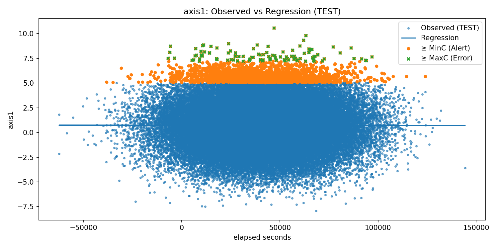
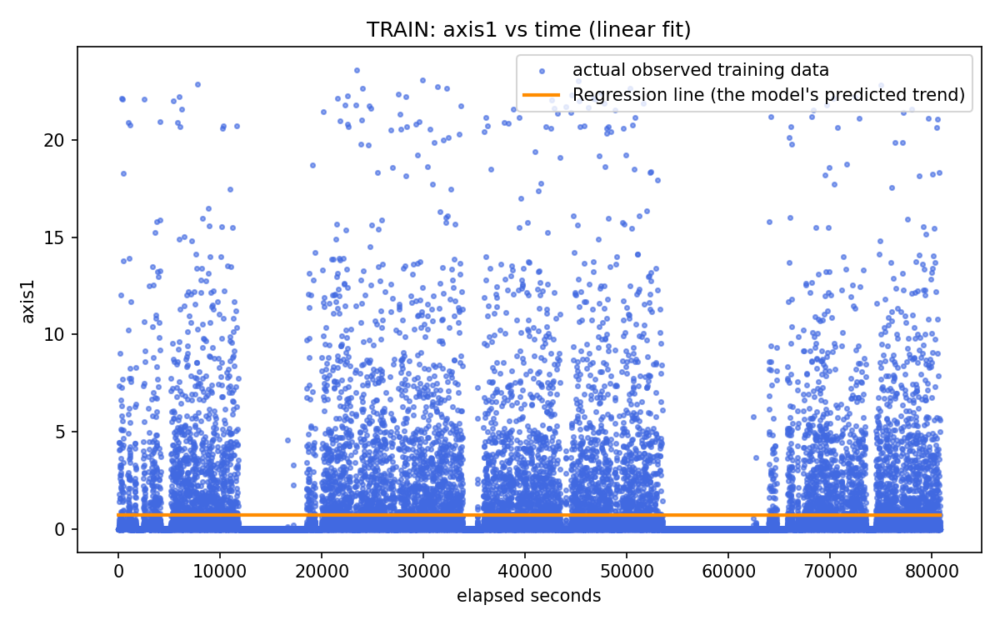
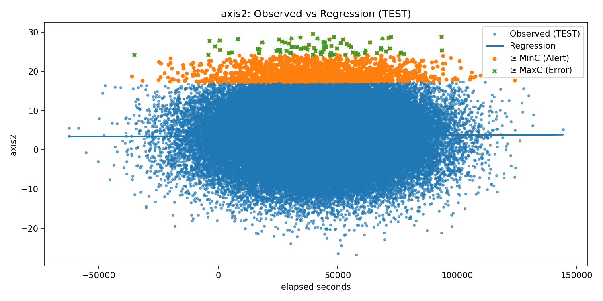
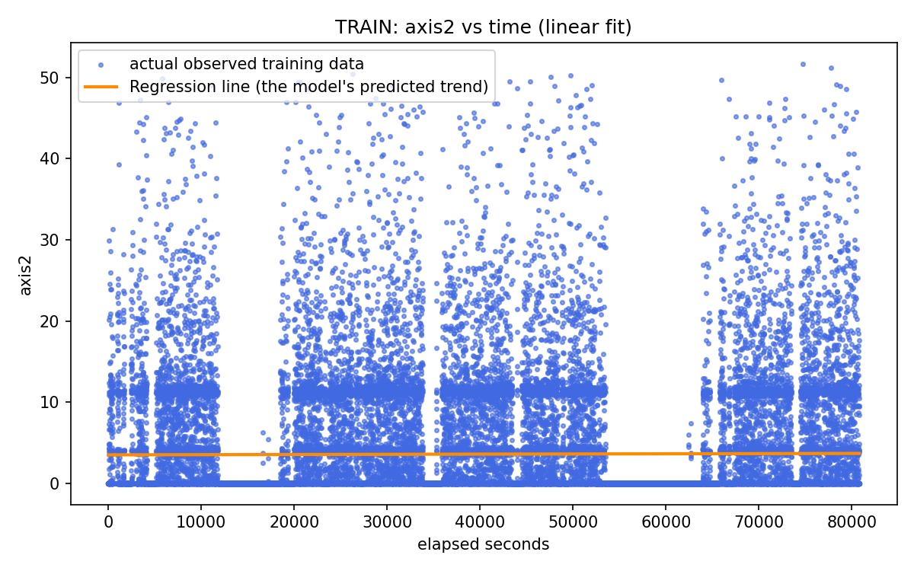
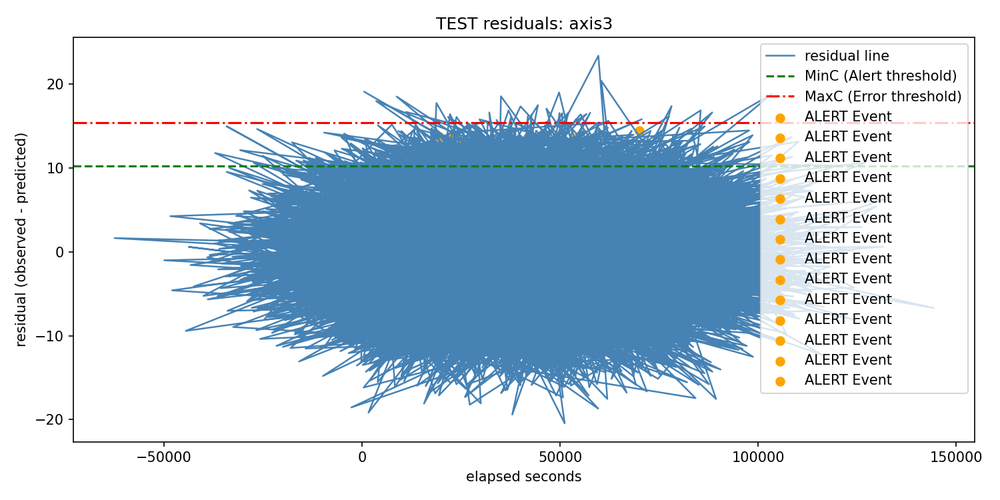
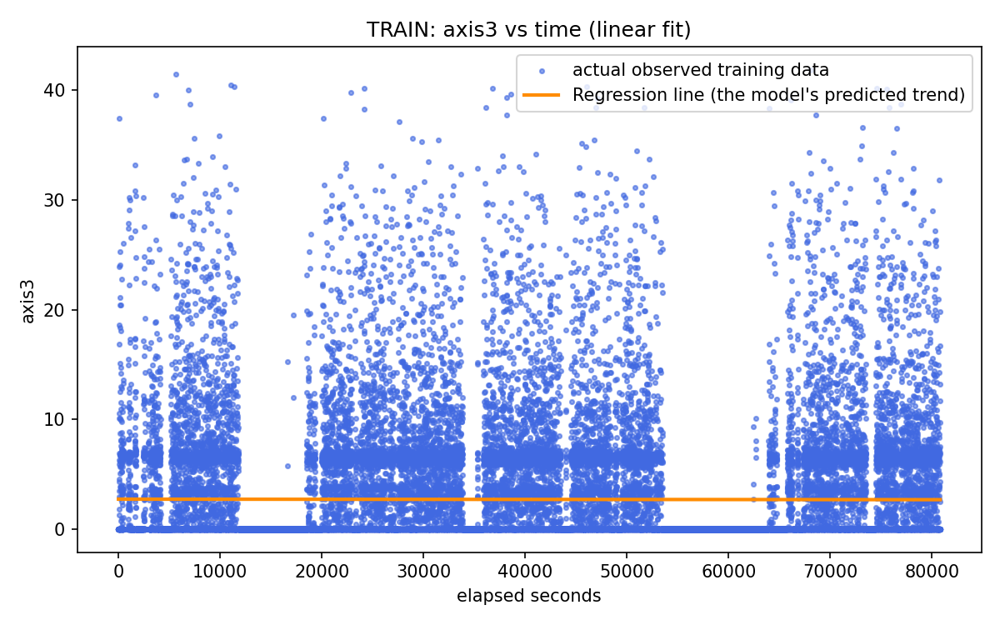
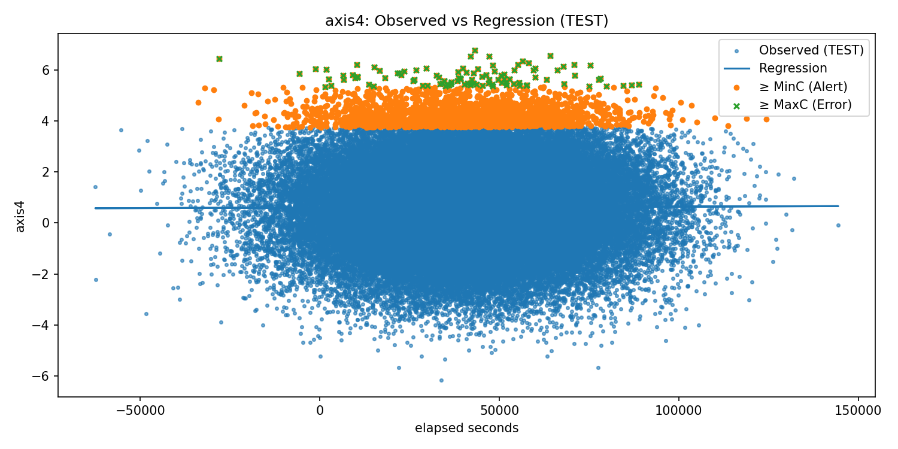
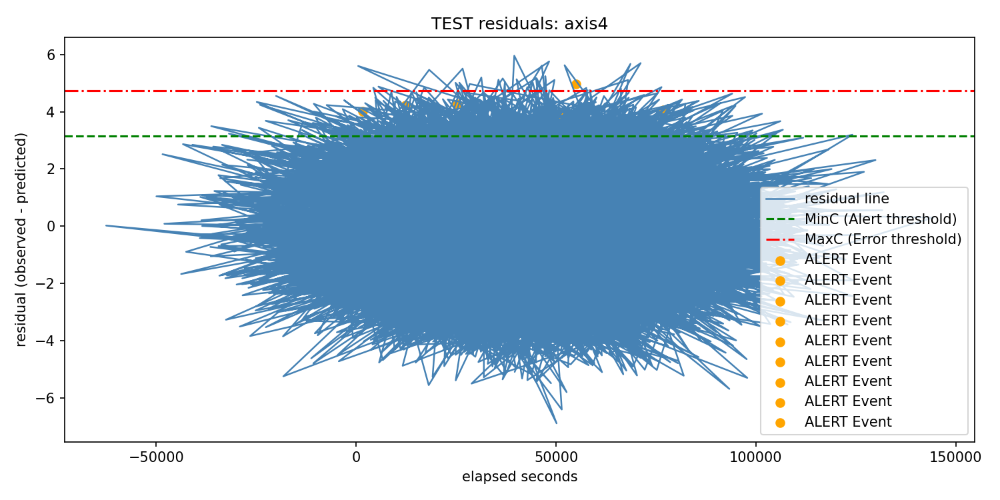
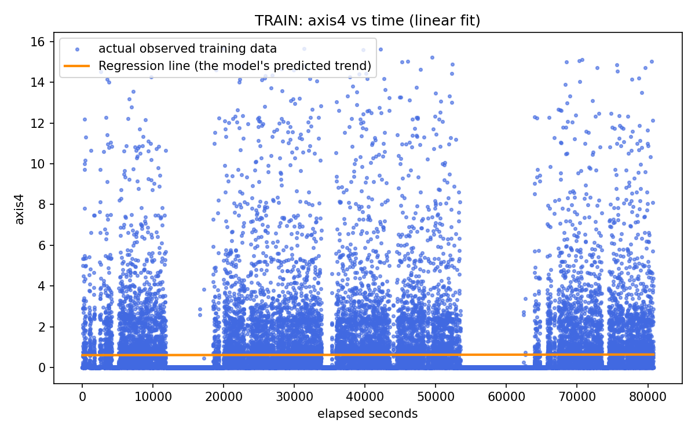
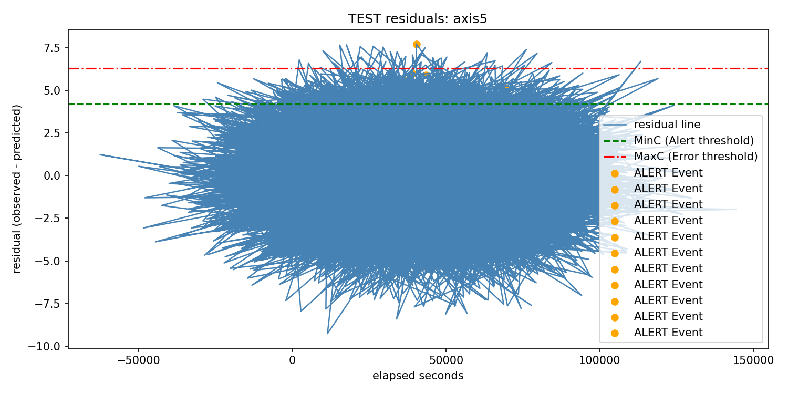

# Lab 1: Streaming Data for Predictive Maintenance with Linear Regression–Based Alerts

**Repository:** `lab_1_streaming_data_for_predictive_maintenance_with_linear_regression`  
**Title:** **Predictive maintenance pipeline**  
**Author:** Albright Maduka  
**Course:** CSCN 8010

---

##  Aim
Detect early signs of abnormal behavior in a robot **before** breakdown by modeling **time (X‑axis)** against **current readings (Y‑axis)** and flagging anomalies with thresholded residuals.

---

##  Requirements & Setup

**Python packages**
- pandas  
- numpy  
- matplotlib  
- scikit-learn  
- SQLAlchemy  
- psycopg2-binary

**Install (bash):**
bash
python -m venv .venv
.\.venv\Scripts\activate

# install the requirement
pip install -r requirements.txt

`requirements.txt`
pandas
numpy
matplotlib
scikit-learn
SQLAlchemy
psycopg2-binary

1.  Database Integration 

1.1 Connection to Neon database: Connected to my NeonDB using Sqlalchemy, tested the connection and verified the table structure (staging measurements).

1.2 Inspect Table Schema (columns & types): Checking tables.

1.3 Safe Time Conversion, Downloading and Preprocessing staging measurements from NeonDB and Saving as CSV: Downloaded my staging_measurements, converted the time column to ISO 8601, seconds, axes 1-8, saved as my original_training_data.csv.

2. Streaming Simulation
2.1 Max/Min per Axis (Train vs Synthetic): Printed the maximum and minimum current per axis for both training data and synthetic test data. 
2.2 Range (Max − Min) per Axis: Calculating the range between the currents in the Original and synthetic data: calculated the range = max − min for each axis in both training and synthetic data.
2.3 Generating synthetic data that has same mean and standard deviation as the original training data: Generated the synthetic data with the same mean(mu) and standard deviation (sigma) as the original_training data. Then saved it as csv.

3. Regression Models & Residual Analysis.
3.1 Artifacts & Paths (data/, artifacts/, plots/): Creating a folder path for the Artifacts: created a folder for my artifact or output results.
3.2 Loading the Train and Test Datasets: Loaded the training data and test data to confirm the row and column.
3.3 Converting timestamps to seconds:
- Ensured that both the training data and synthetic dataset have seconds
3.4 Train linear Regression Model and saving the model parameters as csv: 
- Fitted a linear regression using elapsed time (seconds) as the X-axis and current (axis1–axis8) as the Y-axis.

- Extracted slope and intercept values for each axis and saved the results to model_params.csv in the artifacts folder.

3.4 Residuals on Original Training Data:
- Computed residuals = (Observed − Predicted) for each axis.

- Saved results in train_residuals.csv inside the artifacts folder.

 4. Testing Residuals with Thresholds (Anomaly Detection) and saving as thresholds csv: 
- Calculated Alert threshold: MinC = 2 × sigma (T = 30 seconds ).

- Calculated Error threshold: MaxC = 3 × sigma (T= 30 seconds).

- Saved results to thresholds.csv in the artifacts folder

5. Alerts & Errors implemention

5.1 Computing Residuals (errors) on Synthetic Data

5.2 Detect Alerts & Errors

6. Visualization (16-18) 
6.1  Comparing Observed vs Regression (Visualization)
6.2 Training Regression plot (Visualization): 
6.3 Testing Residuals with Thresholds and events or testing the system for anomalies(Visualization):
- Created per-axis residual plots (axis1 - axis8) using elapsed time (seconds) on the x-axis and residuals (Observed − Predicted) on the y-axis.

- Overlaid threshold lines: Green dashed = MinC (Alert threshold) and Red dash-dot = MaxC (Error threshold)

- Plotted event markers:

Orange = ALERT events (residual ≥ MinC for ≥ T seconds)

Red = ERROR events (residual ≥ MaxC for ≥ T seconds)

- Saved outputs to plots/ inside the artifacts folder (e.g., axis1_test_residuals.png).
- Note: Why there are no errors and only alerts is because the synthetic data did not produce residuals large enough and long enough to exceed the error threshold (MaxC)

6.4 Summary Dashoard of Alerts and Errors : 
- the summary of the alerts and errors that was seen

 Outputs (CSV & Plots)

[axis2_test_](./artifacts/plots/axis2_test_residuals.png)

- **time** — original timestamp (ISO‑8601, UTC)
- **__time_s** — elapsed seconds from the first training timestamp (float)
- **axis1 … axis8** — current readings per axis (float)
- **{axis}_resid** — residuals = observed − predicted (float)
- **thresholds.csv** — columns: `axis`, `sigma`, `MinC`, `MaxC`, `T_seconds`
- **alerts_log.csv** — columns: `axis`, `level`, `start_time`, `end_time`, `duration_sec`, `peak_residual`
- **summary_dashboard.csv** — columns: `axis`, `alerts`, `errors`, `longest_event_s`

## Notes
- `T_seconds` defaults to **30 s** but is configurable in code.
- Ensure your synthetic data’s timestamp base aligns with training `t0` so `__time_s` is comparable.
- If your plots or logs are empty, verify thresholds are not too strict and that residuals are being computed.

---

## Quickstart
1. Install requirements (see above).
2. Run your notebook or script to:
   - Export training CSV from NeonDB
   - Generate synthetic CSV
   - Train regression models
   - Compute residuals, thresholds, and events
   - Render plots and dashboards
3. Review CSV outputs in `artifacts/` and plots in `artifacts/plots/`.