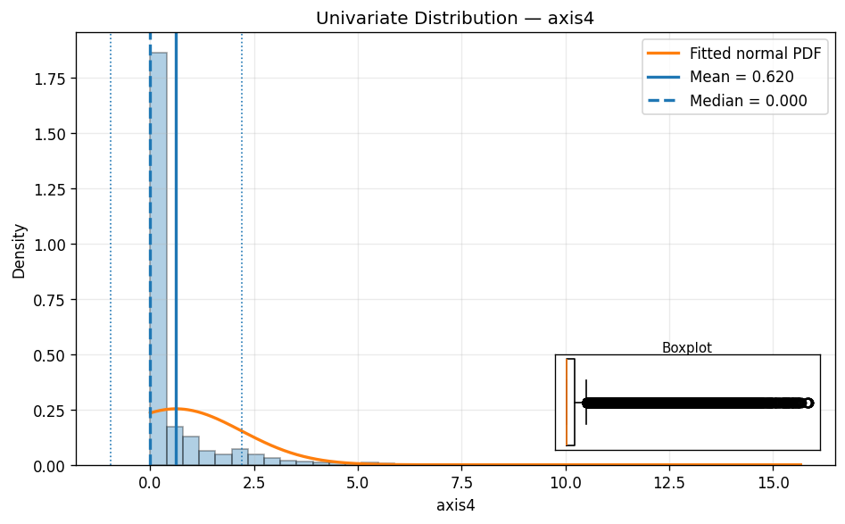

# Lab 1: Streaming Data for Predictive Maintenance with Linear Regression–Based Alerts
# Repository: lab_1_streaming_data_for_predictive_maintenance_with_linear_regression
# Title: Predictive Maintenance Pipeline
# Author: Albright Maduka
# Course: CSCN 8010

# Aim
Detect early signs of abnormal behavior in a robot before breakdown by modeling time (X‑axis) against current readings (Y‑axis) and flagging anomalies with thresholded residuals.

# Requirements & Setup
All required packages are listed in requirements.txt.
Install with:

python -m venv .venv
.\.venv\Scripts\activate
pip install -r requirements.txt

# Key packages:
pandas
numpy
matplotlib
scikit-learn
SQLAlchemy
psycopg2-binary
Artifacts & Outputs

# Artifacts & Outputs
* All output CSVs are in artifacts/
alerts_log.csv
model_params.csv
summary_dashboard.csv
test_residuals.csv
test_with_predictions.csv
thresholds.csv
train_residuals.csv
* All plots are in artifacts/plots/

# Workflow
1. Database Integration:
 - Connect to NeonDB, download and preprocess measurements, save as CSV.

2. Streaming Simulation:
 - Generate synthetic data matching training statistics.

3. Regression Models & Residual Analysis:
- Train linear regression models, compute and save residuals.

4. Thresholds & Anomaly Detection:
- Calculate alert/error thresholds, detect events, save results.

5. Visualization:
- Generate and save per-axis plots with event markers.

6. Summary Dashboard:
- Summarize alerts and errors in dashboard CSV.

# Data Dictionary
* time — original timestamp (ISO‑8601, UTC)
* __time_s — elapsed seconds from first training timestamp
* axis1 … axis8 — current readings per axis
* {axis}_resid — residuals = observed − predicted
* thresholds.csv — columns: axis, sigma, MinC, MaxC, T_seconds
* alerts_log.csv — columns: axis, level, start_time, end_time, duration_sec, peak_residual
* summary_dashboard.csv — columns: axis, alerts, errors, longest_event_s

# Quickstart
* Install requirements (see above).
* Run your notebook or script to:
- Export training CSV from NeonDB
- Generate synthetic CSV
- Train regression models
- Compute residuals, thresholds, and events
- Render plots and dashboards
* Review CSV outputs in artifacts/ and plots in artifacts/plots/.